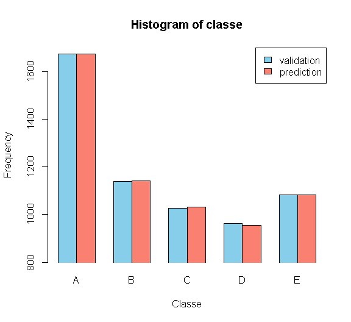

### Overview

Using devices such as Jawbone Up, Nike FuelBand, and Fitbit it is now
possible to collect a large amount of data about personal activity
relatively inexpensively. These type of devices are part of the
quantified self movement – a group of enthusiasts who take measurements
about themselves regularly to improve their health, to find patterns in
their behavior, or because they are tech geeks. One thing that people
regularly do is quantify how much of a particular activity they do, but
they rarely quantify how well they do it. In this project, your goal
will be to use data from accelerometers on the belt, forearm, arm, and
dumbell of 6 participants. They were asked to perform barbell lifts
correctly and incorrectly in 5 different ways.

The data come from this source:
<http://groupware.les.inf.puc-rio.br/har>.

### Loading the data

    download.file("https://d396qusza40orc.cloudfront.net/predmachlearn/pml-training.csv", destfile="training.csv")
    traindata<-read.csv("training.csv",sep=",")
    download.file("https://d396qusza40orc.cloudfront.net/predmachlearn/pml-testing.csv", destfile="testing.csv")
    testing<-read.csv("testing.csv",sep=",")

    library(randomForest)
    library(caret)

### Split the data

Set the seed for reproducibility and split the traind data into 70%
testing and 30% validation.

    set.seed(2468)
    inTrain<-createDataPartition(y=traindata$classe, p=0.7, list=F)
    training<-traindata[inTrain,]
    validation<-traindata[-inTrain,]
    dim(training)

    ## [1] 13737   160

    dim(validation)

    ## [1] 5885  160

### Cleaning the data

A lot of variables have "NA" and " ". Impute the missing values or drop
the variables to increase the accuracy of our model.

    a<-apply(is.na(training),2,sum)
    table(a)

    ## a
    ##     0 13460 
    ##    93    67

67 variables have 13460 "NA"s out of 13737 observations. Remove these
unnecessary variables.

    training<-training[,a==0]

    a2<-apply(training=="",2,sum)
    table(a2)

    ## a2
    ##     0 13460 
    ##    60    33

33 variables have 13460 " "s out of 13737 observations. Remove these
unnecessary variables.

    training<-training[,a2==0] 

"new\_window" is a factor variable with two levels: "yes" or "no".

    sum(training$new_window=="no")

    ## [1] 13460

13460 out of 13737 obs have the value "no". For the obs with the value
"yes", some variables have error values such as "DIV/0!". Remove this
"new\_window". We can also drop "X", "user\_name",
"raw\_timestamp\_part\_1", "raw\_timestamp\_part\_2", and
"cvtd\_timestamp".

    training<-training[,-(1:6)]

Perform the same cleaning process on the validation and the testing data
set.

    validation<-validation[,a==0]
    validation<-validation[,a2==0]
    validation<-validation[,-(1:6)]

    testing<-testing[,a==0]
    testing<-testing[,a2==0]
    testing<-testing[,-(1:6)]

    dim(training)

    ## [1] 13737    54

    dim(validation)

    ## [1] 5885   54

    dim(testing)

    ## [1] 20 54

### Fitting a model

A ramdom forest model was selected because of its high accuracy.

    modFit<-randomForest(classe~., data=training)
    predval<-predict(modFit, validation)
    confusionMatrix(predval, validation$classe)

    ## Confusion Matrix and Statistics
    ## 
    ##           Reference
    ## Prediction    A    B    C    D    E
    ##          A 1673    2    0    0    0
    ##          B    1 1137    3    0    0
    ##          C    0    0 1023    9    0
    ##          D    0    0    0  955    0
    ##          E    0    0    0    0 1082
    ## 
    ## Overall Statistics
    ##                                           
    ##                Accuracy : 0.9975          
    ##                  95% CI : (0.9958, 0.9986)
    ##     No Information Rate : 0.2845          
    ##     P-Value [Acc > NIR] : < 2.2e-16       
    ##                                           
    ##                   Kappa : 0.9968          
    ##  Mcnemar's Test P-Value : NA              
    ## 
    ## Statistics by Class:
    ## 
    ##                      Class: A Class: B Class: C Class: D Class: E
    ## Sensitivity            0.9994   0.9982   0.9971   0.9907   1.0000
    ## Specificity            0.9995   0.9992   0.9981   1.0000   1.0000
    ## Pos Pred Value         0.9988   0.9965   0.9913   1.0000   1.0000
    ## Neg Pred Value         0.9998   0.9996   0.9994   0.9982   1.0000
    ## Prevalence             0.2845   0.1935   0.1743   0.1638   0.1839
    ## Detection Rate         0.2843   0.1932   0.1738   0.1623   0.1839
    ## Detection Prevalence   0.2846   0.1939   0.1754   0.1623   0.1839
    ## Balanced Accuracy      0.9995   0.9987   0.9976   0.9953   1.0000

Our accuracy is 99.75% and the expected out of sample error is 0.25%.

### Result

Use the random forest model to predict "classe" of the testing data.

    predtest<-predict(modFit, testing)
    predtest

    ##  1  2  3  4  5  6  7  8  9 10 11 12 13 14 15 16 17 18 19 20 
    ##  B  A  B  A  A  E  D  B  A  A  B  C  B  A  E  E  A  B  B  B 
    ## Levels: A B C D E
